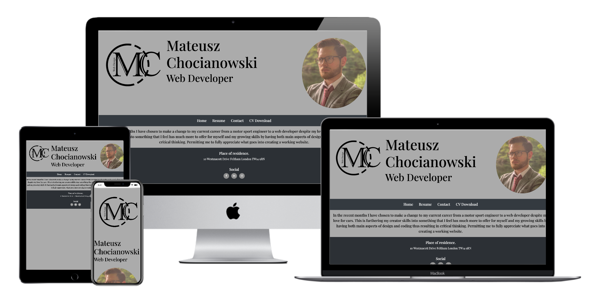
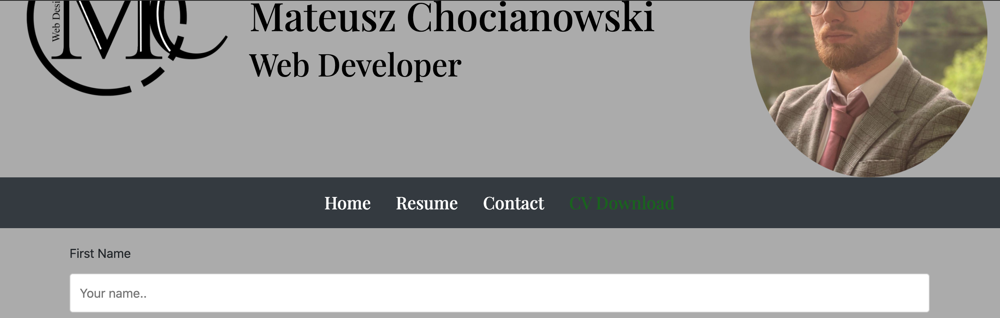
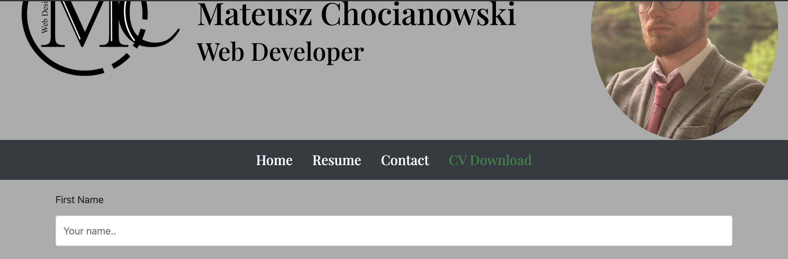
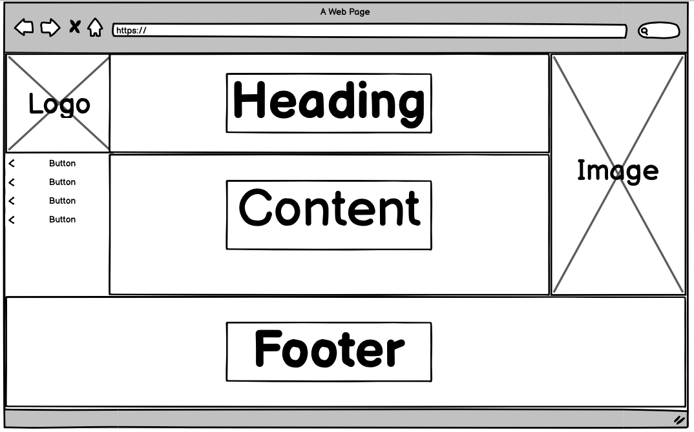
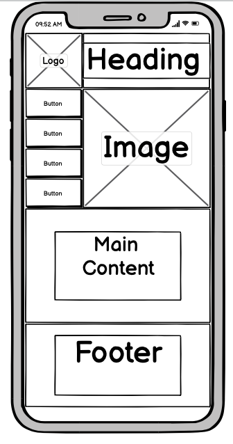

# **_Milestone-Project-HTML-CSS_**  

# **_Introduction:_**

This is my first milestone project for the code institute. The project objective
is to design a static website using what I have learnt during the first few modules based on
HTML and CSS. For this project I will be designing my virtual resume, this is because
I feel my other ideas will be better suited for future projects when working with more advanced languages. 
I feel that my resume will be a good foundation for my portfolio and will allow me to demonstrate a variety 
of features allowed by HTML and CSS along with the use of bootstrap.

# **_Purpose:_**
The website above was created solely for the purpose of achieving the first Milestone Project for the Code 
Institute's Full Stack Developer course.The website was developed using the knowledge gained from the HTML, 
CSS and User Centric Design modules. Additionally several technologies were used to improve the website's design 
despite some limitations due to the lack of knowledge of other, more advanced programming languages.

# **_User Experience Design:_**

## *The Surface Plane:*

### *The font:*

The type of font used in the website was something very similar to the fonts commonly used e.g. Times New Roman
because it provides a more up to date visual that would allow users to see that the website isn’t falling into a 
trap where it is seen as a more outdated, it still gives a professional outlook. It does this by being readable, 
there isn’t any curly letters that can make it hard to read, but it is still bold and professional enough to 
stand out on the page. The spacing between each letter also allows it to be more easily read for a wider range 
of audiences.  

### *The imagery:*

The image chosen for this website has been kept to the same image used twice, once in the header which repeated 
throughout the website and the other in the card. It is a cv website where users are looking for an easy, quick
read. Using one image allows this to be done as they aren’t being distracted by the amount of images on the page, 
they have seen the first image when opening the website and again when on the download page which they don’t need 
to study again because they recognise that it is the same, thus saving time. 
 
The logo has been kept to a basic colour scheme so that it is slick and professional. As the image chosen has 
colour keeping the logo to black and white allow it to stand out against the image yet not clash with it and 
therefore don’t allow users to become confused where to look. The logo and the image are circle in the header 
which can be seen on every page. This circle shape draws you to look at it straight away. Rather than the square 
which became too bulky for the size of the header. The colour changes between the information blocks allows it 
to be easily organised and kept simplistic resulting in no confusion.
 
### *The colour scheme:*

The colour scheme derived from the logo. There is a very neutral colour scheme which allows us to be concentrated 
on the text and the information being portrayed keeping users attention, making the user experience quicker and 
easier to follow to get to what they are looking for. Nav.hover is green to add discrete colour to the website 
so that it is more visually attractive as a neutral colour scheme can become to dull. Green was chosen because 
it is one of the main colours in the profile image allowing it to not become messy with colours. It is still very 
sleek and remains professional. The green text originally was too dark and became hard to read after a while of 
looking at it, so it was lightened a few shades lighter to overcome this issue. As can be seen in the screenshots 
below.

## Before:

## After:

## *Skeleton:*
 

## *Differences to design:*
As can be seen when comparing my wireframes to my final website, the two are a little different, I initially wanted the
creator image to be a full body image which scaled vertically down the page and the nav bar would be on the opposing side 
also vertically scaled. This was a huge road block for me in the begining when trying to understand how bootstrap grid system 
worked and due to the image ending so far down the page, my 'section' wouldn't be until quite far down this is obviously because 
I could not start another row before the largest column of the previous row had ended thus I completly changed my layout in the end whilst 
still keeping everything I planned, just in a different manner.

## *Structure:*

For a website to be able to meet their user needs this website needs to be simple for finding information quickly, 
easy to use and most importantly provide the relevant information. his website provides all of these things. 
It’s simple in the way that there isn’t too mush going on, with aspects such as design and depth of narrative. 
The links that are allocated to each page are easy to follow and very obvious with being centred and having 
enough space between each link, meaning that users are able to spot them easily and one of the first things 
they are drawn to. And finally easy to use because there are four pages to the website each one containing their 
own information without steering away from relevant information. The information that they are primarily looking 
for is apart of a download link which is very clearly set out under the CV download page, making it easy to 
allocate and follow allowing them to get exactly what they are looking for. The experience of using this 
website is very swift. 
 
## *Scope*

The planned features for the website are:

* A website logo- This could evolve to the creators business logo, for now it just aims to give the website a more 
proffessional feel for when potential employers access the website.

* An image of the creator- Since it is a cv website, having an image of the creator or alternatively when desining 
the page for someone else that persons image is important. This is so that any user can put a face to the information they take from visiting the website.

* A Page Heading- The page heading for a cv website will be the creators name, and occupation.

* About-me- The home page should contain a small about me section, this will introduce them to the user when the user first clicks ont the site. 
This should aim to keep the user on the site.

* Progress skill bars- On the resume page (page 2. Of the site) There will be progress bars with the creators skills, 
these can be updated as progress in their career is made.

* A contact form- There will be a contact form to allow any potential employers or people interested in working 
with the creator to fill in the form and be contacted back.

* A thank you message after form submission- The thank you message will display upon form submission, this is to acknowledge 
the user and to inform them that the form was successfully submitted.

* An option to download the CV.

## *Website Features*
### *Existing:*
* A website logo

* An image of the creator.

* A Page Heading.

* About-me.

* Progress skill bars.

* A contact form.

* A thank you message after form submission.

* An option to download the CV.

_Note_: The curerent implemented features are the same as the proposed features, this may be a good thing simce I implemented everything I palnned,
however I see that it may also not be so great that I didn't add much else. This is because I have found that during the duration of this first 
milestone project; it has been a massive learning curve for myself. Had I planned better there may have been features I would have liked to have added 
these will be described further down in features to come at a later stage backed up with a reason for why they were not added this time.

### *Future:*
In the future, I'd like to be able to add a feature so that the contact form inform's the creator of the site when a form is submitted. 
Unfortunatly due to the lack of javascript knowledge and php knowledge I was not able to do this at the moment.
I would also like to add a little more interactivness, for example I came across a feature I liked on w3schools where an image would 
rotate 180 degrees when hovered over to display some information. Small details like this I believe could improve the interactivness of the site, 
however due to running out of time this was something I was unable to do for the submission of this project.

## *Strategy:*
 
For this website the users accessing it are people and businesses who are interested in hiring for their company. 
As a creator of this website, the business needs, need to be met. In this instance, the pages need to portray 
the kind of person that the creator is, even before they have opened the cv. This is so the users want to be keep on 
looking through which visually is what we should be creating at the start. Adapting what the users need and 
want to see has been a main focus in creating the website. As a user being drawn in to want keep looking is 
the main goal. With this there is a small 'about me' section that hasn’t mentioned much just a snippet of what 
is to come in the CV download before they reach the relevant information. Users will form their own opinion 
straight away of what they are seeing on the page. This allows the first judgment to be broken down, and not 
implemented negatively whilst getting to the information required because they will have a tiny understanding 
of who the creator already is. Resulting in correct businesses needs for the website which is to show you are right 
match for the users. 

## *technologies*

* HTML
    * HTML is the main language used to complete the structure of the Website throughout milestone project one.
* CSS
    * CSS is the language used to style the website in milestone project one.
* Google Chrome Developer Tools
    * Google chrome built in developer tools were used to inspect page elements and help debug issues.
* Google Fonts
    * Google fonts are used throughout the project to import the Libre Baskerville and Cabin fonts.
* Bootstrap
    * Bootstrap framework was used for layout during this project.
* Font Awesome
    * Font awesome Icons were used for the Social media links contained in the Footer section of the website.
* Techsini
    * Multi Device Website Mockup Generator was used to create the Mock up image in the readme.md file.
* GitHub
    * GithHub is the hosting site used to store the source code for the Website.
* Git
    * Git is the version control software used to commit and push code to the GitHub repository where the source code is stored.
* Balsamiq Wireframes
    * Used to create wireframes for User experience design.
* Favicon
    * Favicon.io was used to make the website favicon.

## *Deployment*
### *Project creation:*
I started the project by retrieving the template supplied by code institute and clicking 'Use this template'. 
I named the repository: Milestone-Project-HTML-CSS and selected the 'Include all branches' checkbox. 
Once the above steps were complete I opened the newly created repository and clicked the green gitpod button which took me to gitpod where I began the coding.

I used the following commands throughout the project:
git commit: commit message explaining the updates, this command was used to to commit changes to the local repo.
git push: The command is used to push all commited changes from the local repo to the GitHub repository.

### *Deploying Using Github Pages:*

    * Navigate to the GitHub Repository:
    * Click on the 'Settings' Tab.
    * Scroll Down to 'Git Hub Pages' Heading.
    * Select 'Master Branch' as the source.
    * Click the Save button.
    * Click on the link to go to the live deployed page.

### *Deploying by running off a local machine:*
    * Begin by Navigating to the GitHub Repository.
    * Then click the Code drop down menu.
    * You can either choose to Download the ZIP file, unpackage locally and open with IDE (This route ends here) 
    alternatively copy the Git URL from the HTTPS dialogue box.
    * Open your developement editor of choice and open a terminal window in a directory of your choice.
    * Use the 'git clone' command in terminal followed by the copied git URL.
    * Finally a project clone will be created locally on your machine.

## *Citations* 
* [Link](https://gist.github.com/danrovito/977bcb97c9c2dfd3398a) to list of all countries in the world used in the form.

* Tried to use java script to open the download cv link using this [code](https://stackoverflow.com/questions/4907843/open-a-url-in-a-new-tab-and-not-a-new-window)

* [Assessment criteria](https://courses.codeinstitute.net/courses/course-v1:codeinstitute+FE+2017_T3/courseware/c75714c9636b4cf59120d60acbec6ffd/f851a16813f14b3aae7bd1e6560443cd/)

* Onsubmit event was taken from [here](https://www.w3schools.com/jsref/event_onsubmit.asp)

* The inital footer code was taken from rosie's [project](https://github.com/Code-Institute-Solutions/resume-miniproject-bootstrap4/blob/master/09-adding-footer-content/assets/css/style.css) It was then edited to suit my needs.

* The intial contact form code was taken from [here](https://www.w3schools.com/howto/howto_css_contact_form.asp)

* The Nav bar code was taken from [bootstrap](https://getbootstrap.com/docs/4.0/components/navs/) where I also learnt about horizontal alignment of the nav bar.

* [Google Fonts](https://fonts.google.com/specimen/Playfair+Display?sidebar.open=true&selection.family=Playfair+Display:wght@400;500;600;700;800;900)

* [Colour Hex](https://www.colorhexa.com/007600)

* [Multi Device Website Mockup Generator](http://techsini.com/multi-mockup/index.php)

* Create a [Contact-Card](https://www.w3schools.com/howto/howto_css_cards.asp)

* Create a [Favicom](https://favicon.io/favicon-converter/)

[5 User planes](https://ozchen.com/5-planes-content-strategy/)